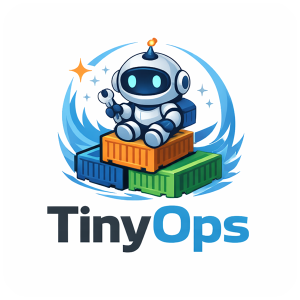

<p align="left">
  <h1>TinyOps</h1>
</p>

<p align="left">
  <strong>Lightning Fast Container Orchestration</strong>
</p>

<p align="left">
  
  
  
</p>

<p align="left">
  
</p>

<p align="left">
  <a href="#features">Features</a> •
  <a href="#quick-start">Quick Start</a> •
  <a href="#blueprint">Blueprint</a> •
  <a href="#api">API</a> •
  <a href="#license">License</a>
</p>


---

TinyOps is a simple, fast and easy to use single-node container orchestrator that turns a single 
YAML file into a fully managed infrastructure with automatic deployments, pipelines, load balancing, 
SSL certificates, and self-healing containers.

## Key Features

⚡ **Git to running App** - Point to your Git Repository and let TinyOps do the rest

🚀 **Zero-Config Deployment** — Define your stack in one YAML file and deploy instantly

⚖️ **Built-in Load Balancing** — Automatic NGINX reverse proxy with upstream health checks

🔒 **Auto-SSL** — Let's Encrypt certificates provisioned and renewed automatically

🔄 **Self-Healing** — Containers are automatically recreated if they crash or get removed

📊 **REST API** — Full control over your infrastructure via HTTP endpoints

🔧 **Pipelines** — Deploy your apps directly by providing your git url

🐳 **Docker Native** — Works directly with Docker, no additional runtime required

## Quick Start

### Using Docker (Recommended)

> [!NOTE]
> Create your first initial `blueprint.yaml` next to your Docker command. Prefer including the TinyOps UI service below so you get a dashboard immediately. Change `domain` to a DNS name that points at your host machine. You can access the Dashboard with your auth key.

```yaml
applications:
  - name: tinyops-ui
    image: tarik56/tinyops-ui:1.0.0
    ssl: true
    domain: tinyops-ui.yourdomain.com
    env:
      API_HOST: http://tinyops:5000
```

```shell
docker run -d \
  --name tinyops \
  --network tinyops_network \
  -e AUTH_KEY=your-secret-key \
  -v /var/run/docker.sock:/var/run/docker.sock \
  -v ./blueprint.yaml:/tinyops/blueprint.yaml \
  -v ./tinyops_data:/root/.tinyops \
  tarik56/tinyops-core:latest
```

### From Source

```bash
git clone https://github.com/tarik56/tinyops.git
cd tinyops
pip install -r requirements.txt
cd src
python tinyops.py
```

## Blueprint

Your entire infrastructure is defined in a single `blueprint.yaml`:

```yaml
applications:
  - name: MyApp
    git:
      url: git@github.com:tarik56/my-project.git
      branch: main
    domain: my-app.my-domain.com

  - name: MyUI
    image: nginx
    replicas: 3
```

More complete examples:

- [`docs/example_blueprints/minimal_image.yaml`](docs/example_blueprints/minimal_image.yaml) — apps from container images only
- [`docs/example_blueprints/git_project.yaml`](docs/example_blueprints/git_project.yaml) — build and deploy from a Git repo
- [`docs/example_blueprints/frontend_backend_db.yaml`](docs/example_blueprints/frontend_backend_db.yaml) — multi-service stack


### Blueprint Options

Each item in `applications`:

| Field          | Type    | Required                 | Default | Description                                                                   |
|----------------|---------|--------------------------|---------|-------------------------------------------------------------------------------|
| `name`         | string  | Yes                      | —       | Application name (container naming, DNS alias on the TinyOps network)         |
| `image`        | string  | Yes, unless `git` set    | —       | Image `repository:tag`; with `git`, placeholder until pipeline builds image   |
| `git`          | object  | No                       | —       | If set, build from this repo instead of only using `image`                    |
| `git.url`      | string  | Yes, if `git` set        | —       | Clone URL (HTTPS or SSH)                                                      |
| `git.branch`   | string  | No                       | —       | Set with `url` for git watcher; if missing, no clone/build for that app       |
| `network`      | string  | No                       | —       | Docker network name; created if missing                                       |
| `domain`       | string  | No                       | —       | Hostname for the gateway (HTTP/S)                                             |
| `ssl`          | boolean | No                       | `false` | If `true` and `domain` is set, request a Let’s Encrypt certificate            |
| `replicas`     | integer | No                       | `1`     | Instance count ≥ 0; must be `1` when `ports` is non-empty                     |
| `env`          | object  | No                       | —       | Env keys `[A-Za-z0-9_-]+`; values string, number, boolean, or null            |
| `ports`        | object  | No                       | —       | Map container port → host port (1–65535); host `null` picks a random port     |
| `volumes`      | array   | No                       | —       | Bind or named mounts: `host_or_volume_name:path_in_container`                 |

## Architecture

```
                ┌─────────────────────────────────────────────────────┐
                │                    Internet                         │
                └────────────────────────┬────────────────────────────┘
                                         │
                                     :80/:443
                                         ▼
                                 ┌────────────────┐
                                 │ TinyOps Gateway│◄─────── updates nginx.conf
                                 │ (nginx+certbot)│        & triggers certbot
                                 └───────┬────────┘                │
                                         │                         │
                          ┌──────────────┼──────────────┐          │
                          │              │              │          │
                          ▼              ▼              ▼          │
                    ┌──────────┐   ┌──────────┐   ┌──────────┐     │
                    │  App #1  │   │  App #2  │   │  App #3  │     │
                    └──────────┘   └──────────┘   └──────────┘     │
                          ▲              ▲              ▲          │
                          │              │              │          │
                          └──────────────┼──────────────┘          │
                                         │                         │
                                  creates/manages                  │
                                         │                         │
                                 ┌───────┴───────┐                 │
                                 │ Docker Daemon │                 │
                                 └───────▲───────┘                 │
                                         │                         │
                                 ┌───────┴───────┐                 │
                                 │ TinyOps Core  │─────────────────┘
                                 │ (Controller)  │
                                 └───────▲───────┘
                                         │ reads
                                 ┌───────┴───────┐
                                 │ blueprint.yaml│
                                 └───────────────┘
```

## API

TinyOps exposes a REST API on port `5000`:

| Endpoint | Method | Description |
|----------|--------|-------------|
| `/blueprint` | GET | Get current blueprint configuration |
| `/blueprint` | POST | Update blueprint (triggers reconciliation) |
| `/container/logs/{id}` | GET | Get logs for a managed container by id |
| `/dashboard` | GET | Get system overview and stats |
| `/domain` | GET | List application domains and SSL status |
| `/domain/{domain}/reset-ssl-failed` | POST | Clear SSL creation failed flag for a domain |
| `/pipeline` | GET | List recorded pipeline runs |
| `/system/logs` | GET | Get recent TinyOps log lines |
| `/system/db` | GET | Get persisted pipelines and repos lists |

## Environment Variables

| Variable | Default | Description |
|----------|---------|-------------|
| `LOG_LEVEL` | `INFO` | Logging verbosity (DEBUG, INFO, WARNING, ERROR) |
| `AUTH_KEY` | `random` | Authorization key used for the rest api |

## Requirements

- Docker 20.10+
- Python 3.10+ (if running from source)
- Port 80/443 available for gateway
- Docker socket access (`/var/run/docker.sock`)

## FAQ

<details>
<summary><b>How is TinyOps different from Docker Compose?</b></summary>
<br>
Docker Compose defines and runs containers but doesn't orchestrate them. TinyOps adds a control loop that continuously reconciles desired state, auto-heals crashed containers, manages replicas, and includes a built-in gateway with SSL.
</details>

<details>
<summary><b>How is TinyOps different from Kubernetes?</b></summary>
<br>
Kubernetes is a multinode enterprise grade orchestration tool that offers a wide range of configurations, with this comes a certain complexity and time needed to setup. TinyOps gives you 80% of the value with 5% of the complexity, depending on your needs.
</details>

<details>
<summary><b>How do pipelines work?</b></summary>
<br>
Once a git url is defined instead of an image name, TinyOps clones the repository and builds the docker image, once succesful, it will use it as an image and deploy your app. If there are changes on the target branch, it will get detected, pulled, a new image will be created and your instances will get updated with the new image.
</details>

<details>
<summary><b>What if my pipeline fails?</b></summary>
<br>
Your App will continue running with the previously build image, if it is a new App without an image, it will simply not be deployed. You will be able to see why it failed in the console, logs or UI. 
</details>

<details>
<summary><b>Do I have to use the UI?</b></summary>
<br>
No, not at all, the UI is just an App inside your cluster just as any other App. It makes interacting with TinyOps more comfortable. You could also build your own UI using the OpenApi Spec of TinyOps, or just stick to the console.
</details>

<details>
<summary><b>What happens if a container crashes?</b></summary>
<br>
TinyOps automatically detects the crashed container and reruns it within seconds. TinyOps compares the desired state with actual Docker state and acts accordingly.
</details>

<details>
<summary><b>How does SSL work?</b></summary>
<br>
When you set <code>ssl: true</code> on an application, TinyOps runs Certbot inside the gateway container to obtain a Let's Encrypt certificate. The NGINX config is automatically updated to serve HTTPS and redirect HTTP traffic.
</details>

<details>
<summary><b>What if SSL fails?</b></summary>
<br>
No worries, if it fails, it will continue using HTTP. You will be able to see why it failed, once updated, you will be able via the rest api or UI to initiate a retry.
</details>

<details>
<summary><b>Can I run multiple replicas?</b></summary>
<br>
Yes! Set <code>replicas: 3</code> in your blueprint and TinyOps will create 3 container instances. The gateway automatically load balances traffic across all replicas.
</details>

<details>
<summary><b>What about App to App communication?</b></summary>
<br>
Possible, the internal dns automatically registers the names of your Apps. Example: just pass the name of your Backend App as an Env to your Frontend App and use it as a hostname.
</details>

<details>
<summary><b>How do I update an application?</b></summary>
<br>
Update your blueprint.yaml as you wish, TinyOps will take care of the rest.
</details>

<details>
<summary><b>Can I use private Docker registries?</b></summary>
<br>
Yes, as long as your Docker daemon is authenticated to the registry. TinyOps uses the Docker daemon directly, so any registry Docker can pull from will work.
</details>
